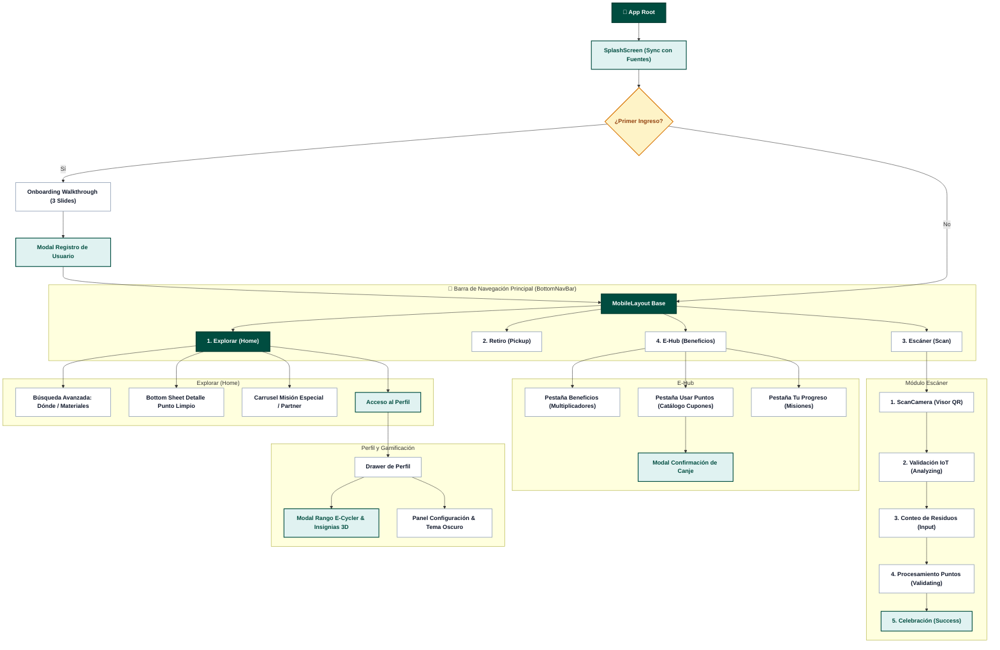
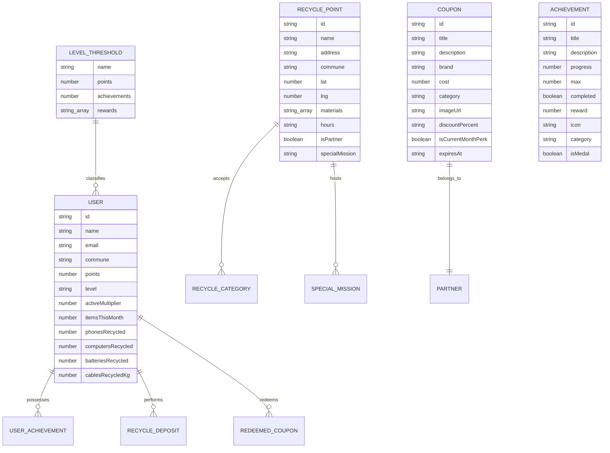
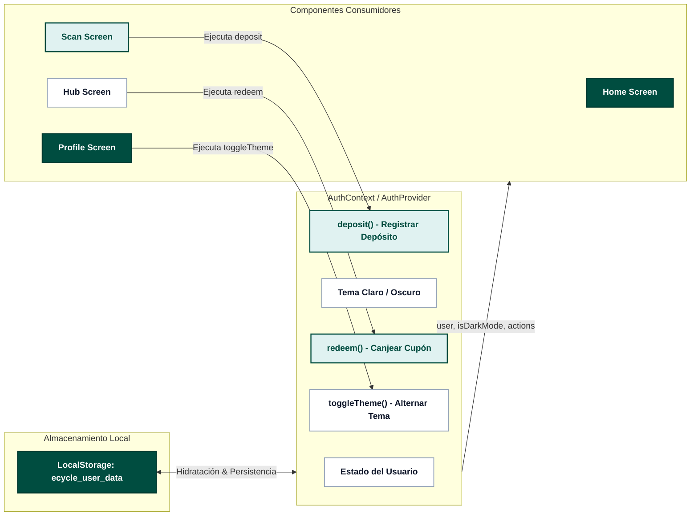

# 🗺️ Arquitectura de la Información (IA) - E-Cycle

Este documento detalla la estructura y jerarquía de información, el mapa del sitio, el modelo de datos y la organización de componentes de la aplicación **E-Cycle**, con un diseño visual estandarizado de alto contraste.

---

## 1. Mapa de Navegación y Jerarquía de Pantallas (Sitemap)

---

## 2. Matriz de Vistas y Componentes

| Pestaña / Vista | Propósito Principal | Componentes Clave | Modales / Overlays Asociados |
| :--- | :--- | :--- | :--- |
| **Explorar (`/explorar`)** | Descubrir puntos limpios en el mapa interactivo, filtrar por residuos y ver campañas especiales del mes. | `InteractiveMap`, `SpecialMissionCard`, `Avatar`, `Button`, `IconButton` | • Overlay Búsqueda y Filtro de Materiales • Bottom Sheet Detalle de Punto • Drawer de Perfil |
| **Escáner (`/escaner`)** | Validar ubicación en punto de reciclaje mediante QR y registrar el depósito de materiales. | `ScanCamera`, `ScanInput`, `ScanSuccess`, `LoadingSpinner` | • Loading / Validación IoT de Contenedor • Selector de Cantidades por Categoría • Resumen de Puntos Ganados |
| **E-Hub (`/ehub`)** | Gestionar multiplicadores de puntos mensuales, canjear beneficios/cupones y monitorear misiones activas. | `Tabs`, `LevelIndicator`, `SearchBar`, `Chip`, `Card`, `Modal`, `EmptyState` | • Modal de Confirmación y Código de Canje • Filtro de Categorías de Beneficios • Acceso a Overlay Rango E-Cycler |
| **Retiro (`/retiro`)** | Solicitar retiros de residuos electrónicos a domicilio y consultar historial de solicitudes. | `IconBox`, `Button`, `EmptyState` | • Alerta de Cobertura Comunal |
| **Perfil (Drawer)** | Gestionar datos de usuario, ver nivel, insignias desbloqueadas, estadísticas de residuos e impacto ambiental. | `LevelIndicator`, `Avatar`, `MenuItem`, `Toggle`, `Button`, `Skeleton` | • **Rango E-Cycler Overlay**: Carrusel de niveles e insignias 3D con efecto Flip • **Configuración**: Modo oscuro, notificaciones, privacidad |

---

## 3. Modelo de Entidades y Datos (ERD)

---

## 4. Estructura de Estado y Flujo de Datos

---

## 5. Tokens de Identidad Cromática por Rango

| Rango | Requisitos Mínimos | Color Primario / Tinte | Ícono / Medalla | Beneficios Destacados |
| :--- | :--- | :--- | :--- | :--- |
| **Descubridor** | 0 pts / 0 logros | Slate (`#64748B`) | `workspace_premium` | Multiplicador x1.0 base, acceso al mapa e historial de impacto. |
| **Ensamblador** | 1.000 pts / 2 logros | Teal / Primario (`#004D40` / `#1DE9B6`) | `workspace_premium` | Multiplicador x1.2 permanente, acceso completo a E-Hub y notificaciones flash. |
| **Recolector** | 2.500 pts / 3 logros | Ámbar / Oro (`#F59E0B` / `#D97706`) | `workspace_premium` | Multiplicador x1.5 permanente, badge de plata, 50% descuento en envíos. |
| **Reactivador** | 5.000 pts / 4 logros | Índigo / Púrpura (`#4F46E5` / `#6366F1`) | `workspace_premium` | Multiplicador x2.0 permanente, avatar dorado exclusivo, retiros prioritarios. |
