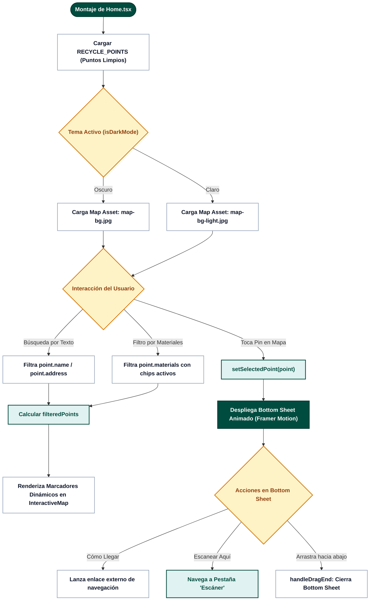
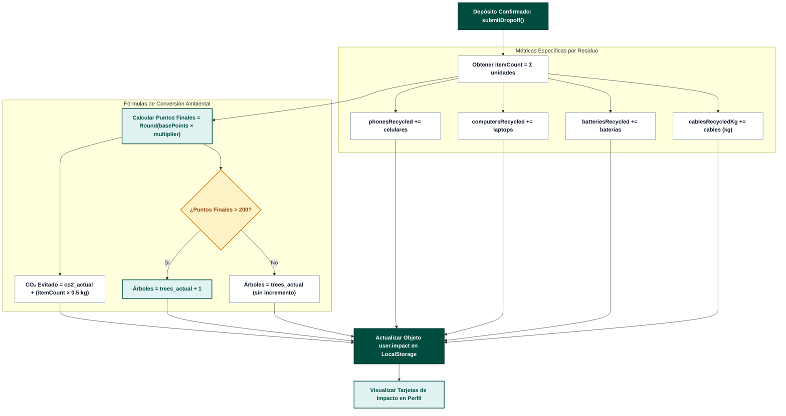
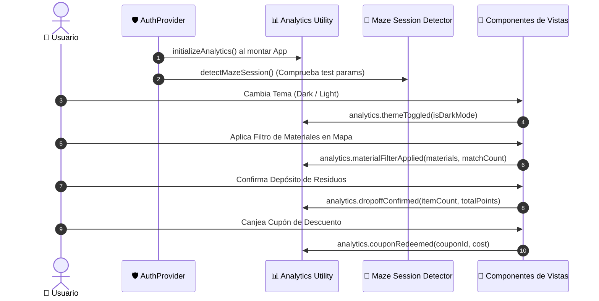
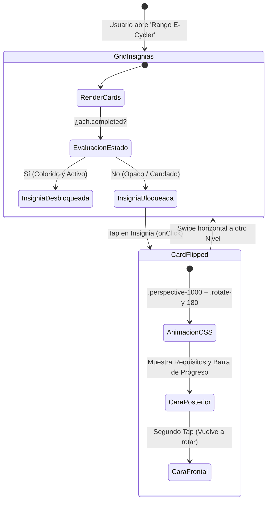
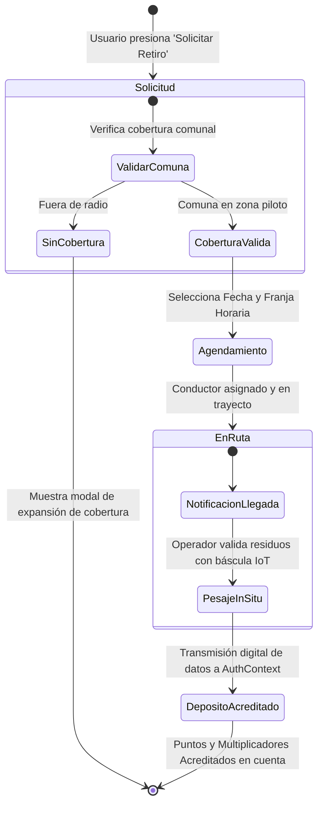

# 🚀 Diagramas Avanzados y Arquitectura de Negocio - E-Cycle

Este documento complementa la suite de documentación con **6 diagramas especializados** extraídos de la lógica técnica, reactividad y modelos de gamificación del repositorio.

---

## 1. 📍 Motor de Geolocalización, Filtrado Espacial y Sincronización del Mapa

---

## 2. 🌲 Motor de Métricas de Impacto Ecológico y Huella Ambiental

---

## 3. 🧩 Jerarquía del Design System (Atomic Design)

```mermaid
graph TD
    classDef primary fill:#004D40,stroke:#00382E,stroke-width:2px,color:#FFFFFF,font-weight:bold;
    classDef step fill:#FFFFFF,stroke:#94A3B8,stroke-width:1.5px,color:#0F172A,font-weight:600;
    classDef highlight fill:#E0F2F1,stroke:#004D40,stroke-width:2px,color:#004D40,font-weight:bold;

    subgraph Atomos ["⚛️ Átomos (src/components/ui)"]
        A1["Avatar"]:::step
        A2["Badge"]:::step
        A3["Button / BackButton"]:::step
        A4["IconButton"]:::step
        A5["Chip"]:::step
        A6["Toggle"]:::step
        A7["Skeleton"]:::step
        A8["IconBox"]:::step
        A9["LoadingSpinner"]:::step
    end

    subgraph Moleculas ["🧬 Moléculas"]
        M1["LevelIndicator (Badge + Pill)"]:::highlight
        M2["SearchBar"]:::step
        M3["MenuItem"]:::step
        M4["Tabs"]:::step
        M5["ProgressBar"]:::step
        M6["CountdownTimer"]:::step
        M7["Modal"]:::step
    end

    subgraph Organismos ["🦠 Organismos"]
        O1["InteractiveMap"]:::highlight
        O2["ScanCamera"]:::highlight
        O3["ECyclerProfileBadgeOverlay (3D Flip)"]:::highlight
        O4["SpecialMissionCard"]:::step
        O5["BottomNavBar"]:::primary
        O6["SplashScreen"]:::primary
    end

    subgraph LayoutsViews ["📱 Layouts y Pantallas"]
        L1["MobileLayout Base"]:::primary
        V1["Home (Explorar)"]:::step
        V2["Scan (Escáner)"]:::step
        V3["Hub (E-Hub)"]:::step
        V4["Pickup (Retiro)"]:::step
        V5["Profile (Drawer)"]:::step
    end

    Atomos --> Moleculas
    Moleculas --> Organismos
    Organismos --> LayoutsViews
```

---

## 4. 🔔 Sistema de Telemetría, Analytics y Detección de Sesión

---

## 5. 🎖️ Matriz de Gamificación, Logros y Máquina de Estados 3D Flip Card

---

## 6. 🚚 Ciclo de Vida y Logística de Retiro a Domicilio (Roadmap Pickup)

