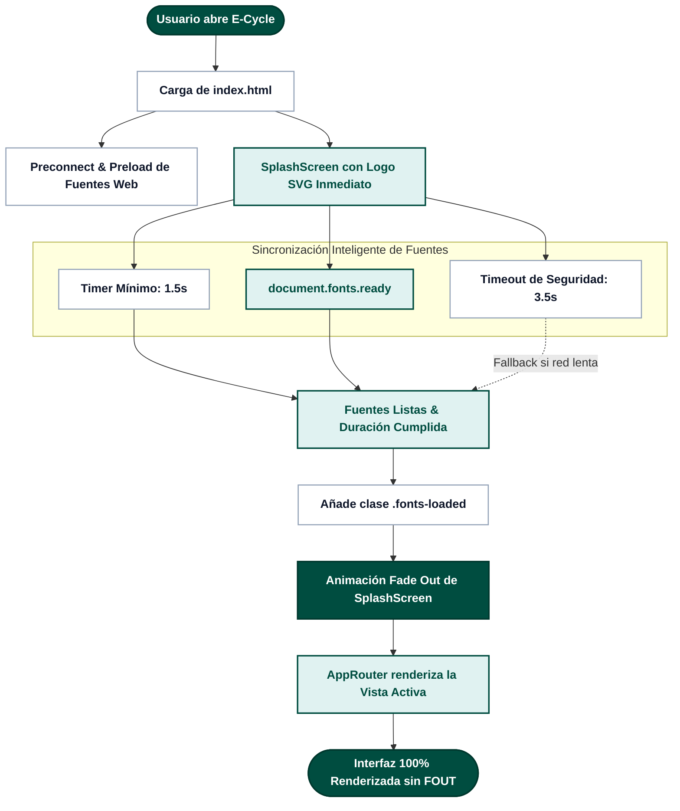
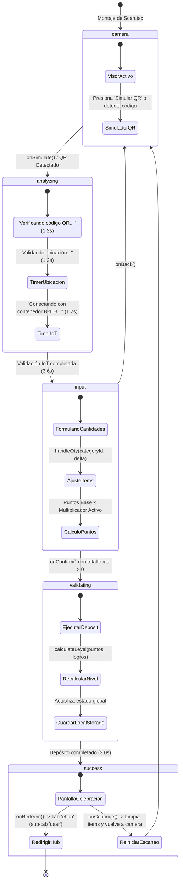
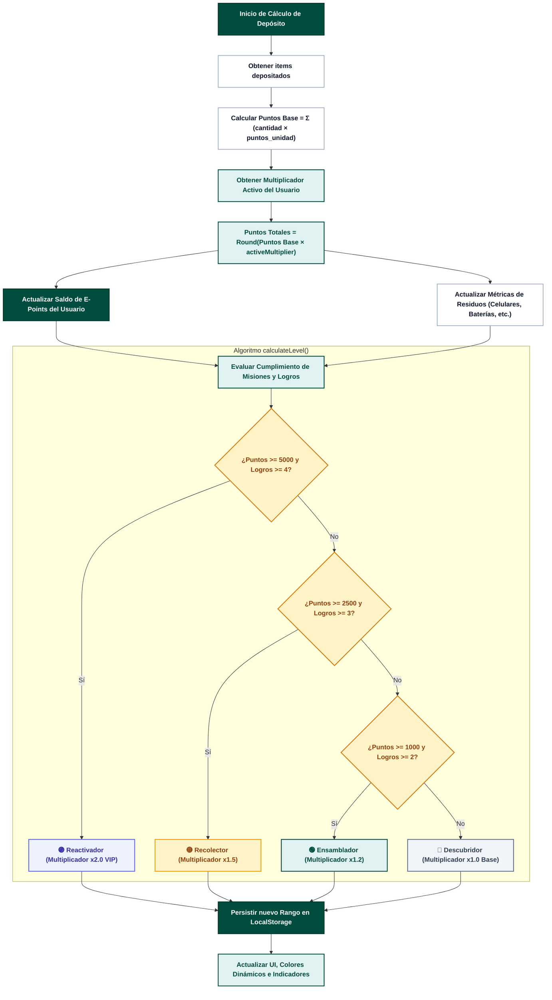
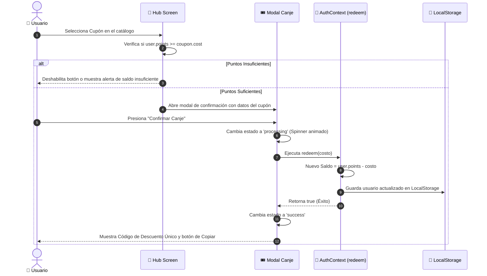
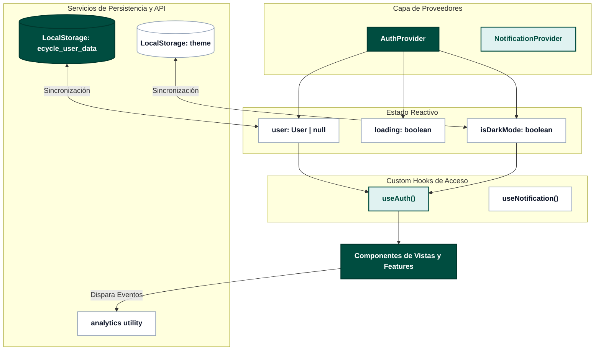

# ⚙️ Diagramas de Flujo de la Aplicación (Application Logic Flowcharts)

Este documento detalla los diagramas de flujo técnico, las máquinas de estado y la lógica de negocio de la aplicación **E-Cycle**, diseñados con una paleta cromática estandarizada y accesible.

---

## 1. Ciclo de Vida de Inicialización y Carga de Recursos (Splash & Fonts)

---

## 2. Máquina de Estados del Módulo de Escáner (`ScanStep`)

---

## 3. Motor de Gamificación, Puntos y Progresión de Rangos

---

## 4. Flujo Transaccional de Canje de Cupones

---

## 5. Arquitectura de Estado y Reactividad (Context Layer)

