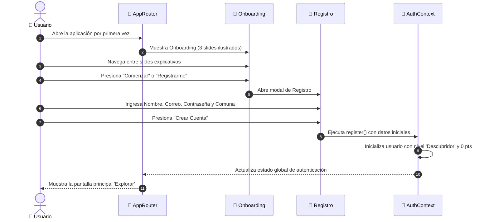
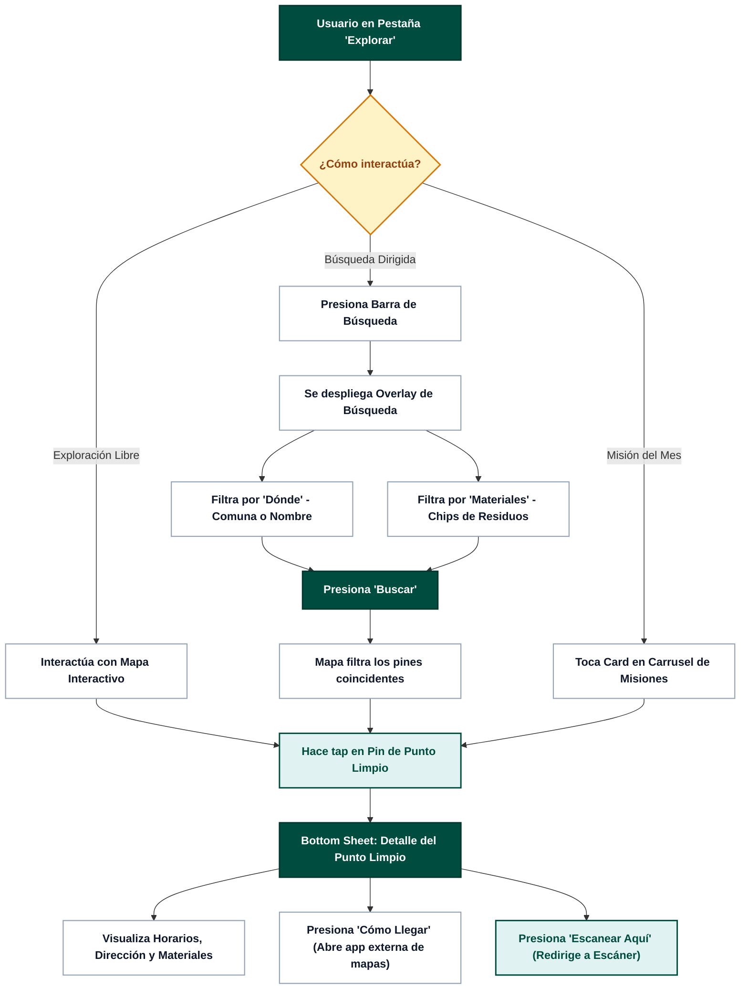
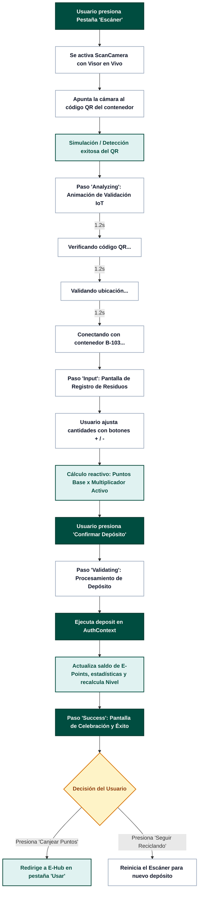
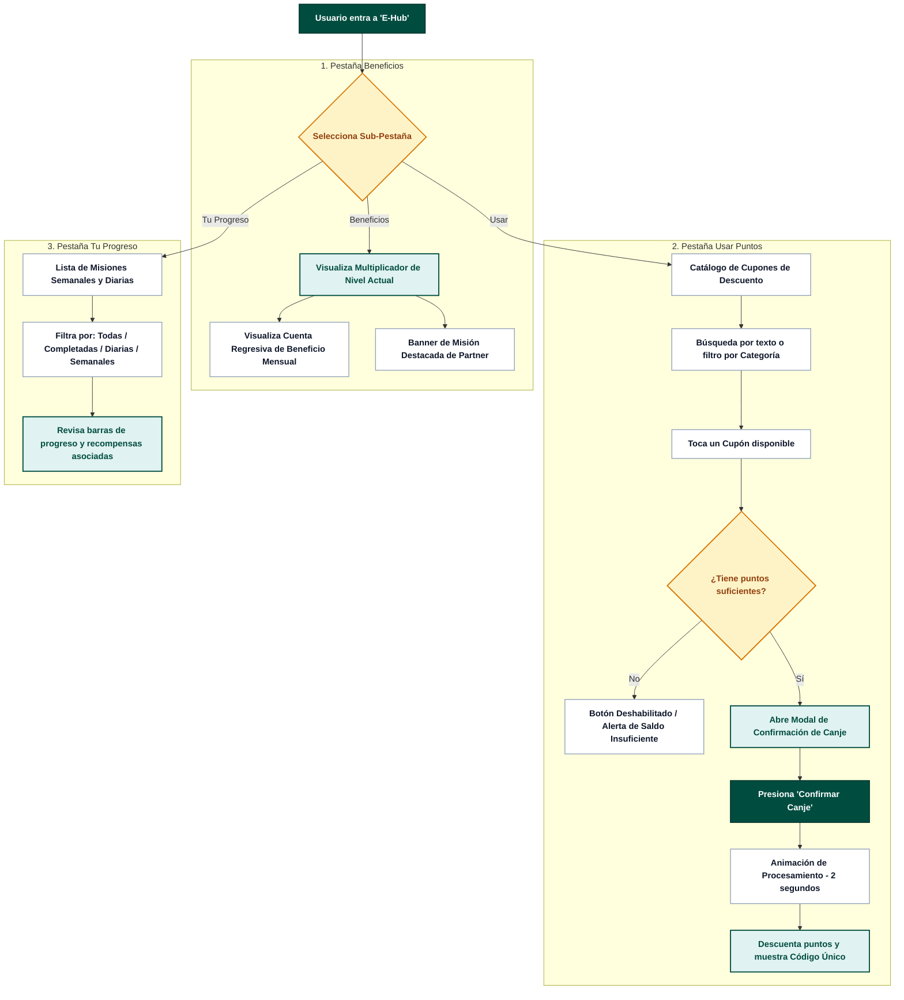
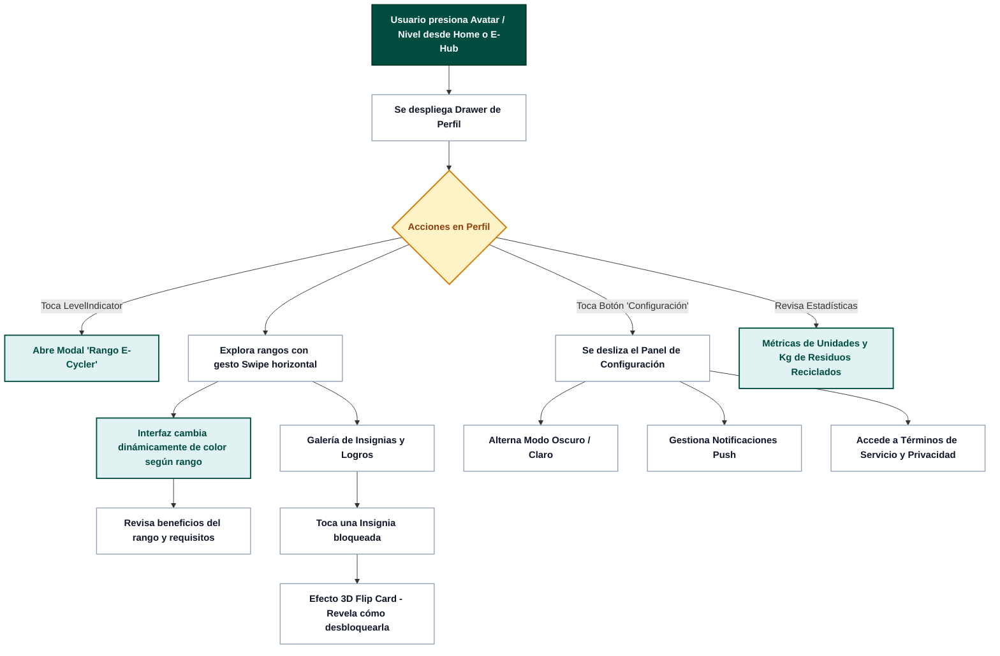
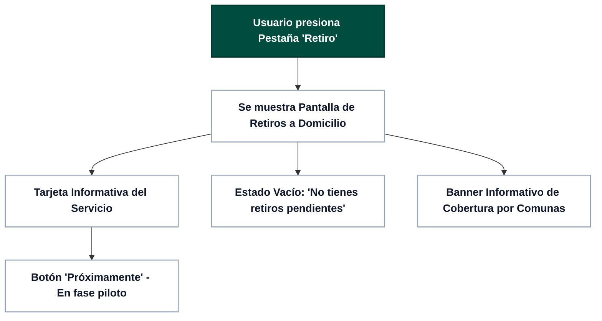

# 👤 Flujos de Usuario (User Flows) - E-Cycle

Este documento describe y diagrama los 6 flujos de usuario principales implementados en la aplicación **E-Cycle**, utilizando una paleta estandarizada de alto contraste.

---

## 1. Flujo de Onboarding y Registro de Nuevo Usuario

---

## 2. Flujo de Exploración del Mapa y Búsqueda de Puntos Limpios

---

## 3. Flujo de Escaneo QR y Registro de Depósito de Residuos

---

## 4. Flujo de E-Hub: Beneficios, Canje de Cupones y Misiones

---

## 5. Flujo de Perfil de Usuario, Rango E-Cycler e Insignias 3D

---

## 6. Flujo de Retiro a Domicilio (Pickup)

